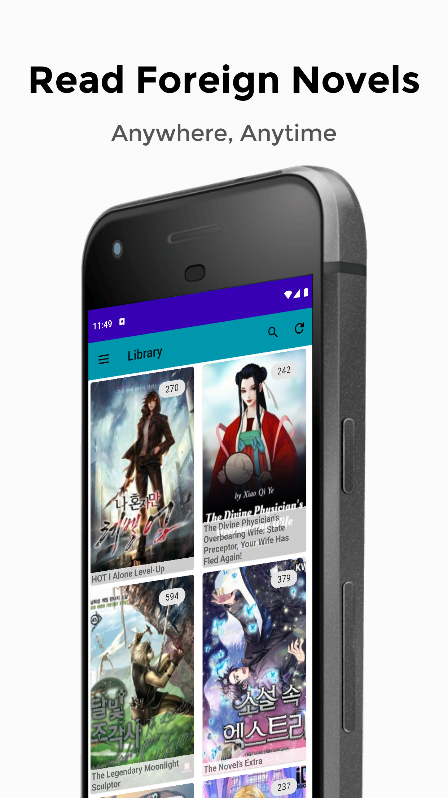
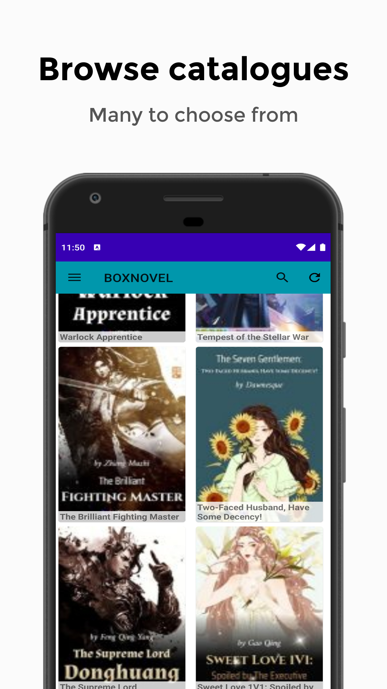
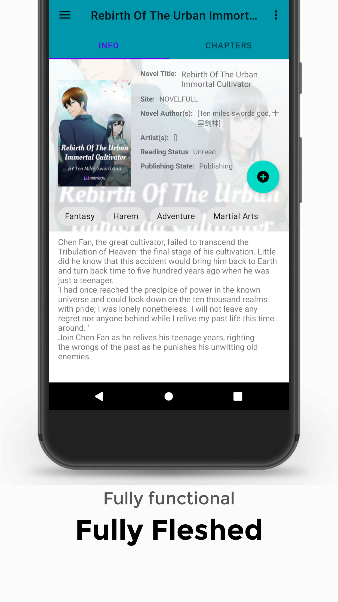
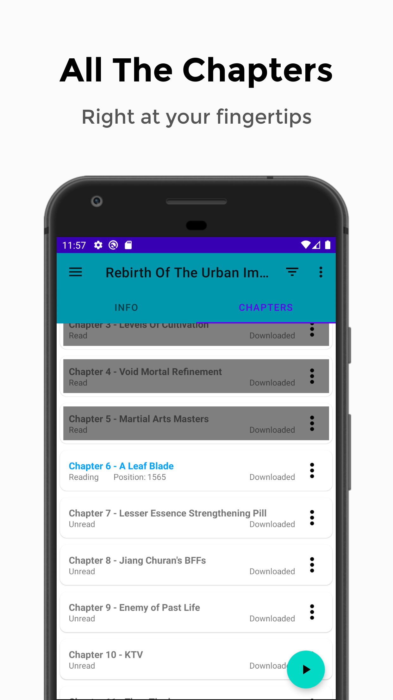
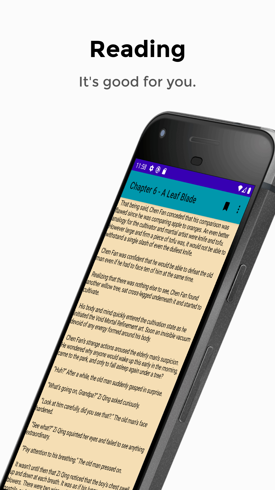

tal 

#  Shosetsu

A free and open source android application for reading novels.  
Use at your own discretion as this app is currently in beta and may have bugs. 
We appreciate any help in improving the app, so let us know by either [opening an issue](../../issues/new) or via Discord.
  
Don't Download Stable! | Download Development! | Download from F-Droid | Download from, UpToDown
---------------------- | --------------------- | --------------------- | -----------------------
 |  |  | 

Join us on our Discord server:

## Capabilities:
- [x] Many sources to read from!
- [x] Add the ones you like to your library!
- [x] Single button press to get all the latest chapters!
- [x] Settings that make you wonder what happened!
- [x] A reader that lets you read! With variable tabbing, spacing, and sizing!
- [x] Download your favorite chapters to read then, or later!
- [ ] Tracking
- [ ] Actually efficient coding

## Screenshots:
</img>
</img>
</img>
</img>
</img>
