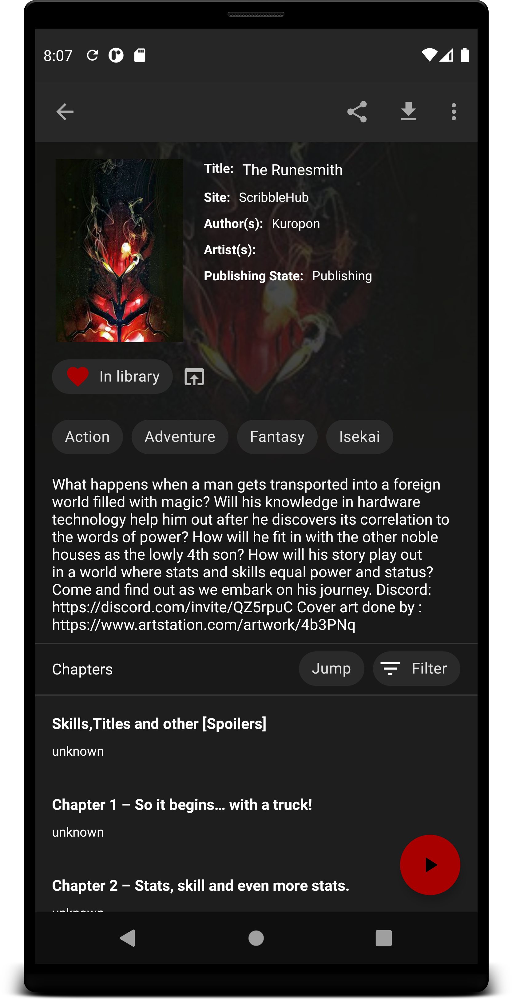
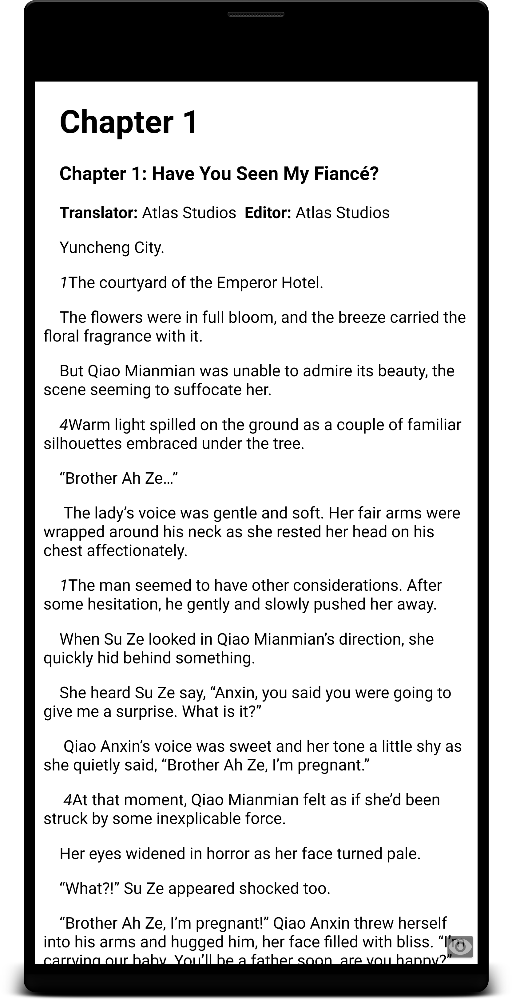
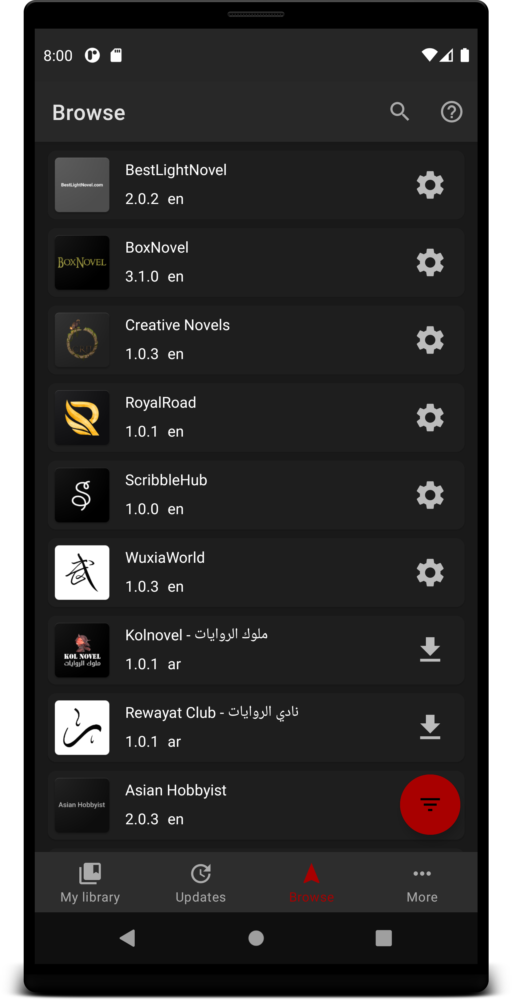
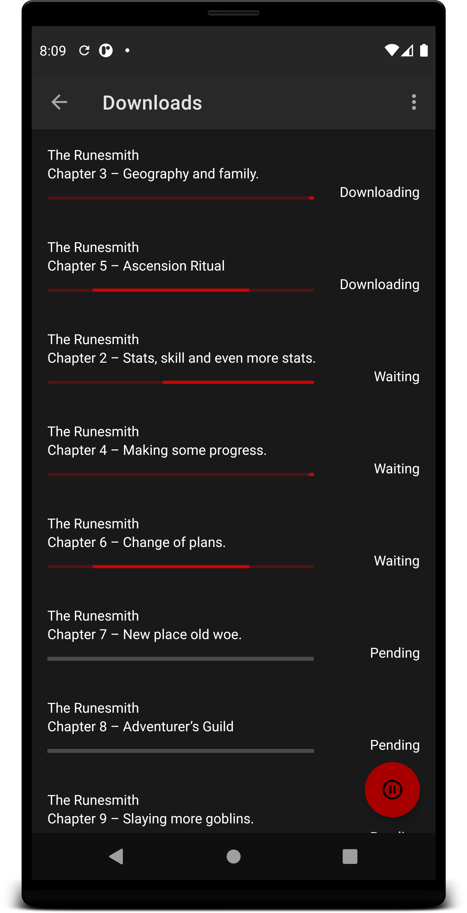
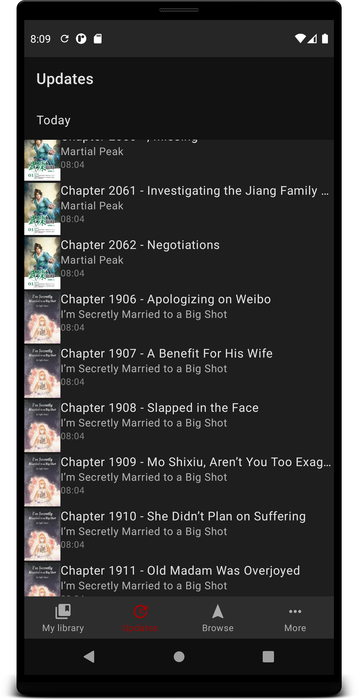

#  Shosetsu

The Free & Open Source Android Application for reading (Light) Novels!

We appreciate any help in improving the app, so let us know by [opening an issue](../../issues/new).

Download Development! | There is no mainline ;-;
---------------------- | ---------------------

Join us on our Discord server:

## Capabilities:

- [x] Many sources to read from!
- [x] Add the ones you like to your library!
- [x] Single button press to get all the latest chapters!
- [x] Settings that make you wonder what happened!
- [x] Completely customizable reader! [1]
- [x] Awesome UI!
- [x] Fast fast fast!

[1] Using HTML reader

## Screenshots:

### Your own catalog!

    </img>

### Novels!

    </img>
    </img>

### Customization!

    </img>

Thank you Sweet0Potato#9784 for the CSS

### Sources for all!

    </img>
    </img>

### Downloading!

    </img>

### Keep track!

    </img>

